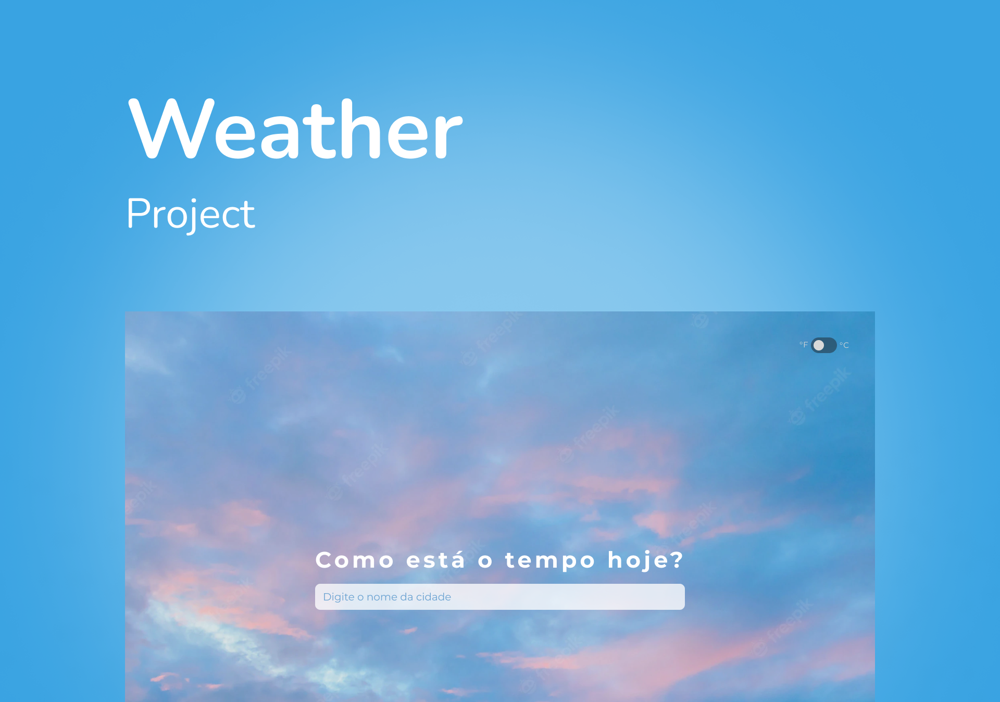

<h1 align="center">Weather Project</h1>



- [Technologies](#technologies)
- [Installation](#installation)
    
## Technologies

- [React](https://reactjs.org/), [Next.js](https://nextjs.org/) and [Typescript](https://www.typescriptlang.org/)
- Styling with [Tailwind CSS](https://www.tailwindcss.com)
- Linting with [ESLint](https://eslint.org/)
- Formatting with [Prettier](https://prettier.io/)
- Pre-commit Git hooks with [Husky](https://github.com/typicode/husky) and [lint-staged](https://github.com/okonet/lint-staged)
- Testing with [Jest](https://jestjs.io/) and [React Testing Library](https://testing-library.com/docs/react-testing-library/intro)

## Installation

This project runs on [Node.js v16](https://nodejs.org/) and uses [Yarn v1](https://yarnpkg.com/) as dependency manager.

1. Clone the repository and install dependencies:

   ```bash
   $ git clone https://github.com/Felipe1496/weather-project.git
   $ cd weather-project
   $ yarn install
   ```

2. To run the project in development mode, run:

   ```bash
   $ yarn dev
   ```
